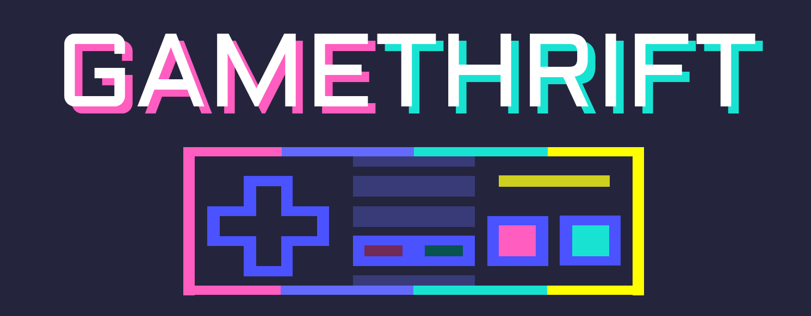
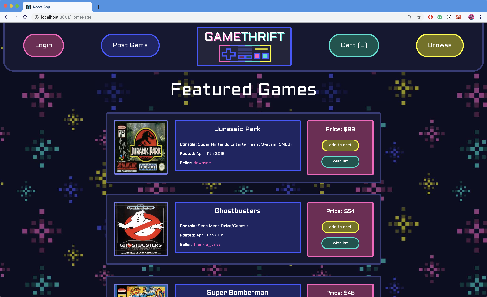
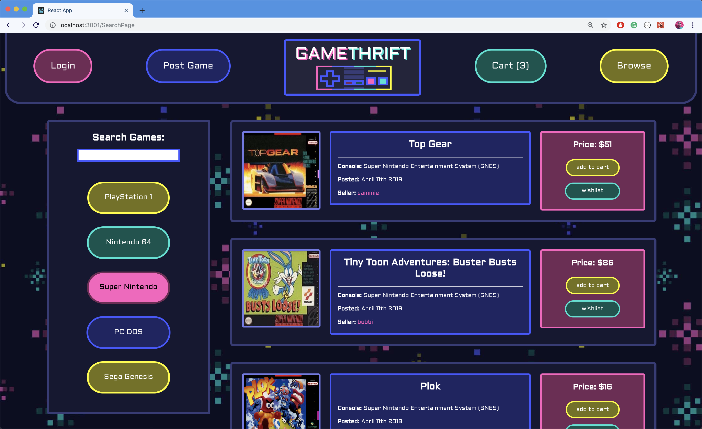
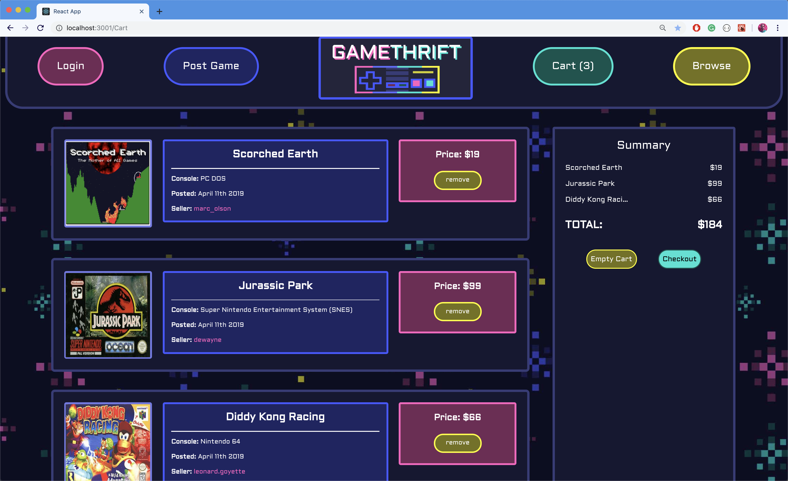

[Demo Video](https://www.youtube.com/watch?v=jWwf6UuNwu0)

A vintage video game e-commerce site for finding all the games you’ve been wanting to play since the 90’s.
Created by Nison Malayev and Evan Pavley.

## Features

We wanted gamethrift's UI to have the look and feel of a classic video game's select screen. The color palette was inspired by arcades and neon signs.

Using the [igdb](https://www.igdb.com/discover) api we pulled images and descriptions from around 100 classic video games and used them to seed our database as user posts. We selected five of the most popular consoles from before the year 2000 to keep our categories short.

Users are able to buy video games through adding them to their cart, the purchases are sustained in a join table in our database. Users and also sell video games through posting them.

## Built With

* [React](https://reactjs.org/) - web library used for building the interface
* [react-router](https://reacttraining.com/react-router/) - for page navigation
* [igdb](https://www.igdb.com/discover) - the api we pulled seed data from
* [Ruby on Rails](https://rubyonrails.org/) - to save users and transaction in a complex **self referencing users table** where a user could be either a buyer or a seller
* [postgreSQL](https://www.postgresql.org/) - as the database
* [CSS](https://developer.mozilla.org/en-US/docs/Web/CSS) - used to customize the UI

## Additional Notes

Evan Pavley designed the logo and repeating pattern background.

[Frontend Repo](https://github.com/EvanPavley/game_thrift_frontend)
